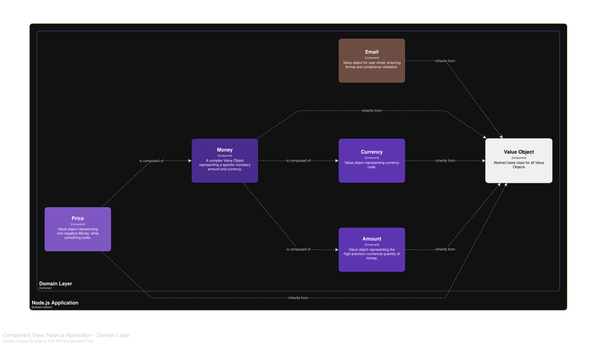
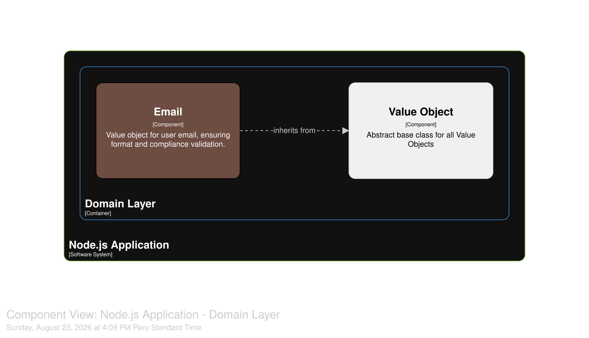
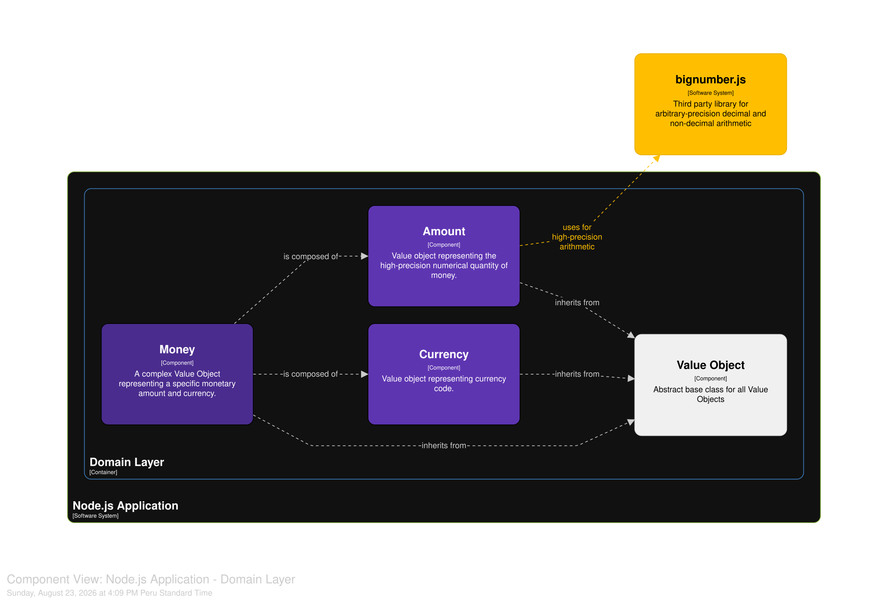
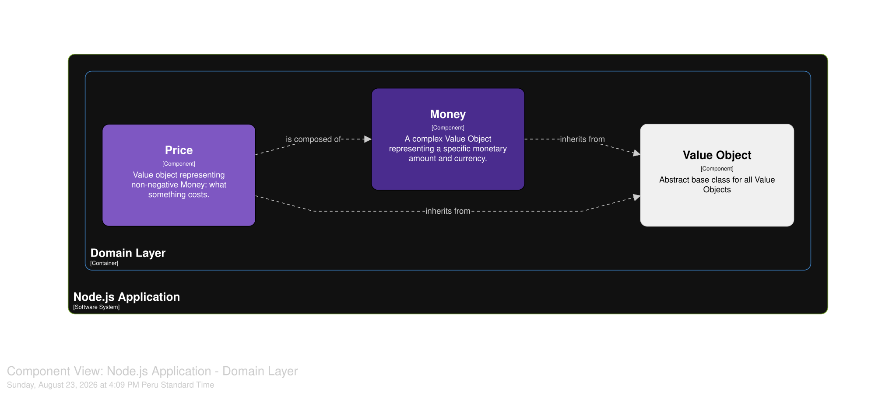

> **Disclaimer**: This `README.md` file was generated by an LLM (Large Language Model).

# Node.js DDD Value Objects

## Project Overview

This project provides a foundational implementation of Domain-Driven Design (DDD) Value Objects in TypeScript, tailored for Node.js applications. It demonstrates how to create immutable value objects that encapsulate data, ensure data integrity through validation, and provide value-based equality comparisons.

The primary goal is to illustrate best practices for designing robust and maintainable domain models using Value Objects, focusing on concepts like immutability, self-validation, and proper equality semantics.

## Core Concepts Illustrated

### 1. Value Objects

Value Objects are objects that measure, quantify, or describe a thing in the domain. They are characterized by:

- **Immutability**: Once created, their state cannot change. Every concrete value object calls `Object.freeze(this)` in its constructor. Because `freeze` is shallow, a field holding a mutable object needs more than that: `Amount` keeps its `BigNumber` in a `#private` field, so no cast can reach it and mutate the value in place. TypeScript's `private` would not be enough — it is erased at compile time.
- **Value-Based Equality**: Two value objects are considered equal if all their constituent attributes are equal, not by their memory reference.
- **Self-Validation**: They enforce their own invariants upon creation. Construction goes through a static factory, so an instance that exists is always valid.
- **No Side Effects**: Operations on value objects return new instances rather than modifying the original.

### 2. The `ValueObject` Abstract Class

The `src/domain/value-object.ts` file defines an abstract `ValueObject` class. This class serves as the base for all concrete value objects in the system, providing:

- A generic `equals(other: unknown): boolean` method that performs deep value-based comparison. It returns `false` for anything that is not a `ValueObject` of the exact same class, then compares components pairwise.
- An abstract `protected equalityComponents(): readonly EqualityComponent[]` method, which concrete subclasses must implement to specify the properties that define their unique value for comparison.

The same file exports the `EqualityComponent` type — `string | number | boolean | Date | ValueObject | null | undefined`. Nested value objects are compared recursively, `Date` values by timestamp, and everything else by `===`.

## Implemented Value Objects

The project includes several examples of practical value objects:

### `Email` (`src/domain/email.vo.ts`)

- Represents an email address.
- Normalizes the address first (trims surrounding whitespace, converts to lowercase) and validates afterwards, so `""` and `"   "` fail for the same reason, and addresses differing only in case are equal.
- Demonstrates basic string-based value object principles.

### `Amount` (`src/domain/amount.vo.ts`)

- Represents a numeric quantity, with no currency attached.
- Utilizes `bignumber.js` to handle precise decimal arithmetic, avoiding common floating-point inaccuracies.
- Accepts `number`, `string` or `BigNumber` input, and rejects both `NaN` and non-finite values, naming each defect for what it is.
- Negative values are allowed — non-negativity is `Price`'s invariant, not this one's.
- Provides arithmetic operations (`add()`, `subtract()`, `times()`, `round()`), predicates (`isZero()`, `isNegative()`, `isPositive()`) and formatting helpers (`toString()`, `toFixed()`, `toJSON()`). `round()` and `toFixed()` reject any scale outside the supported range (0 to 20 decimal places), so neither a `bignumber.js` error nor the heap exhaustion that an enormous scale would cause ever surfaces.
- `times()` accepts a `number`, `string` or `BigNumber` factor. A `number` has already passed through binary floating point by the time it arrives, so a string is the only way to give it an exact one.
- Implements `toJSON()`, because the `#private` field is invisible to `JSON.stringify`: without the hook, an `Amount` would serialise to `{}` and lose its value silently.
- Exposes its equality component as a fixed-notation string, so `1.50` and `1.5` compare as equal.

### `Currency` (`src/domain/currency.vo.ts`)

- Represents a currency code (e.g. `"USD"`, `"EUR"`), along with the number of decimal places its amounts are expressed in.
- Ensures that only predefined, supported currency codes can be used. The supported set lives in `src/domain/types/currency.type.ts` as the `currencyDecimals` map — currently `PEN`, `USD` and `EUR` with 2 decimals, and `JPY` with 0.
- Exposes `Currency.All`, a frozen list of every supported currency, and the static factory `Currency.fromCode()`, which returns the shared instance for a code.

### `Money` (`src/domain/money.vo.ts`)

- A composite value object combining `Amount` and `Currency`.
- Demonstrates how to compose smaller value objects into more complex ones.
- Rounds its amount to the currency's decimal places at construction, so `Money` is always expressed at its currency's precision.
- Includes business logic, such as ensuring that `add()` and `subtract()` are only performed between `Money` objects of the same currency.
- Provides static factory methods — `create()`, which accepts an `Amount`, a `number` or a `string`, and `zero()` for creating zero-value money instances.
- Implements `toJSON()`, which emits `{ amount, currency }` with the amount padded to the currency's scale and the currency as its code alone. Unlike `toString()`, that form round-trips back through `Money.create()`; `decimals` is left out because it is derived from the code.

### `Price` (`src/domain/price.vo.ts`)

- A refinement of `Money`: the amount of money something costs.
- Wraps a `Money` instance and rejects negative amounts, demonstrating how a value object can narrow another one by adding an invariant rather than duplicating its behaviour.

## Project Structure

```
├───src/
│   ├───app.ts                     # Example usage and demonstration of value objects
│   └───domain/
│       ├───types/
│       │   └───currency.type.ts   # Supported currency codes and their decimal places
│       ├───value-object.ts        # Base class for all Value Objects
│       ├───amount.vo.ts           # Value Object for numeric amounts
│       ├───currency.vo.ts         # Value Object for currency codes
│       ├───email.vo.ts            # Value Object for email addresses
│       ├───money.vo.ts            # Composite Value Object for money (Amount + Currency)
│       └───price.vo.ts            # Value Object for non-negative money
├───test/
│   └───domain/                    # One test suite per value object, using node:test
├───architecture/                  # Structurizr workspace and exported diagrams
├───docs/
│   └───agents/                    # Conventions the AI coding skills read
├───CONTEXT.md                     # Domain glossary (ubiquitous language)
├───AGENTS.md                      # Context and rules of engagement for AI assistants
├───package.json                   # Project dependencies and scripts
├───tsconfig.json                  # TypeScript configuration (type-checking)
├───tsconfig.build.json            # TypeScript configuration (emit to dist/)
├───biome.json                     # Biome configuration for linting and formatting
└───...                            # Other configuration and development files
```

## Architecture & Diagrams

This project uses [Structurizr](https://structurizr.com/) to create diagrams based on the C4 model. The diagrams are defined as code in the `architecture/workspace.dsl` file.

### Running Structurizr Locally

You can explore the diagrams locally using the `local` command of the Structurizr tooling, which can be run with Docker. (This replaces Structurizr Lite, which was discontinued in March 2026 — the `structurizr/lite:latest` image is now only a deprecation notice.)

1. **Start the Structurizr container**:

    ```bash
    docker-compose up
    ```

2. **Access the diagrams**: Open your web browser and navigate to `http://localhost:8081`.

The `docker-compose.yml` file is configured to mount the local `./architecture` directory into the container as Structurizr's data directory, so any changes you make to the `.dsl` file are picked up when you refresh the browser. Configuration options can be set in a `structurizr.properties` file in that same directory, or as environment variables on the service.

The container is pinned to `user: "1000:1000"` so that it can write to the mounted directory — the image's default user is the distroless `nonroot` account (UID 65532), which cannot write to a host directory owned by you. Adjust the UID/GID if yours differ (`id -u`, `id -g`).

> **Note**: `architecture/workspace.json` carries a `lastModifiedDate` that Structurizr rewrites on every open. A git `clean` filter keeps that stamp out of the history: `.gitattributes` names the filter, but its definition is local to each clone. See **Local setup** in `AGENTS.md` for the one-off `git config` a fresh clone needs.

### Diagrams Overview

> **Note**: The diagrams below are SVG exports of the architecture. For the most up-to-date and interactive versions, please run Structurizr locally.

The following diagrams are defined in the workspace:

- **Domain-Layer-Overview**: This component diagram shows the value objects within the "Domain Layer" container and their relationships to each other and to the abstract `ValueObject` base class. It provides a high-level view of the value object system.

    

- **Email-Value-Object**: A focused component diagram showing only the `Email` value object and its inheritance from the `ValueObject` base class. This is useful for understanding a single, simple value object in isolation.

    

- **Money-Value-Object**: A more detailed component diagram that illustrates the composite `Money` value object. It shows how `Money` is composed of the `Amount` and `Currency` value objects, their inheritance structure, and the external dependency on the `bignumber.js` library.

    

- **Price-Value-Object**: A component diagram showing how `Price` narrows `Money` by adding a non-negativity invariant, alongside their common `ValueObject` base class.

    

## Technologies Used

- **TypeScript**: For type safety and better code organization.
- **Node.js**: The JavaScript runtime environment.
- **pnpm**: A fast, disk space efficient package manager.
- **bignumber.js**: A JavaScript library for arbitrary-precision decimal and non-decimal arithmetic.
- **tsx**: A TypeScript execution environment for Node.js, enabling direct execution of TypeScript files.
- **node:test**: Node's built-in test runner, used with `node:assert/strict`.
- **Biome**: A fast formatter and linter for web projects.

## Getting Started

To set up the project and run the examples:

### Prerequisites

- Node.js v24 or higher — the TypeScript configuration extends `@tsconfig/node24`.
- pnpm (install globally: `npm install -g pnpm`). The project pins `pnpm@11.23.0` via the `packageManager` field.

### Installation

1. Clone the repository:

    ```bash
    git clone https://github.com/poschuler/nodejs-ddd-value-objects.git
    cd nodejs-ddd-value-objects
    ```

2. Install dependencies:

    ```bash
    pnpm install
    ```

### Running Examples

The `app.ts` file contains various examples demonstrating the usage of the implemented value objects.

To run the examples:

```bash
pnpm dev
```

This command will run `src/app.ts` in watch mode, automatically restarting if you make changes.

To run the compiled version:

```bash
pnpm start
```

## Development

### Running the Tests

Every value object has a suite under `test/domain/`, written with `node:test` and `node:assert/strict` and executed through `tsx`.

```bash
pnpm test           # run every suite once
pnpm test:watch     # re-run on change
pnpm test:coverage  # run with Node's experimental coverage report
```

### Type-Checking

To type-check `src` and `test` without emitting any files:

```bash
pnpm typecheck
```

### Building the Project

To compile the TypeScript code into JavaScript:

```bash
pnpm build
```

This clears the `dist` directory and outputs compiled JavaScript files there, using `tsconfig.build.json` (which compiles `src` only).

### Linting and Formatting

This project uses Biome for linting and formatting.
To check for linting and formatting issues:

```bash
pnpm lint
```

To fix linting and formatting issues automatically:

```bash
pnpm lint:fix
```

## License

This project is licensed under the MIT License. See the `LICENSE` file for more details.
